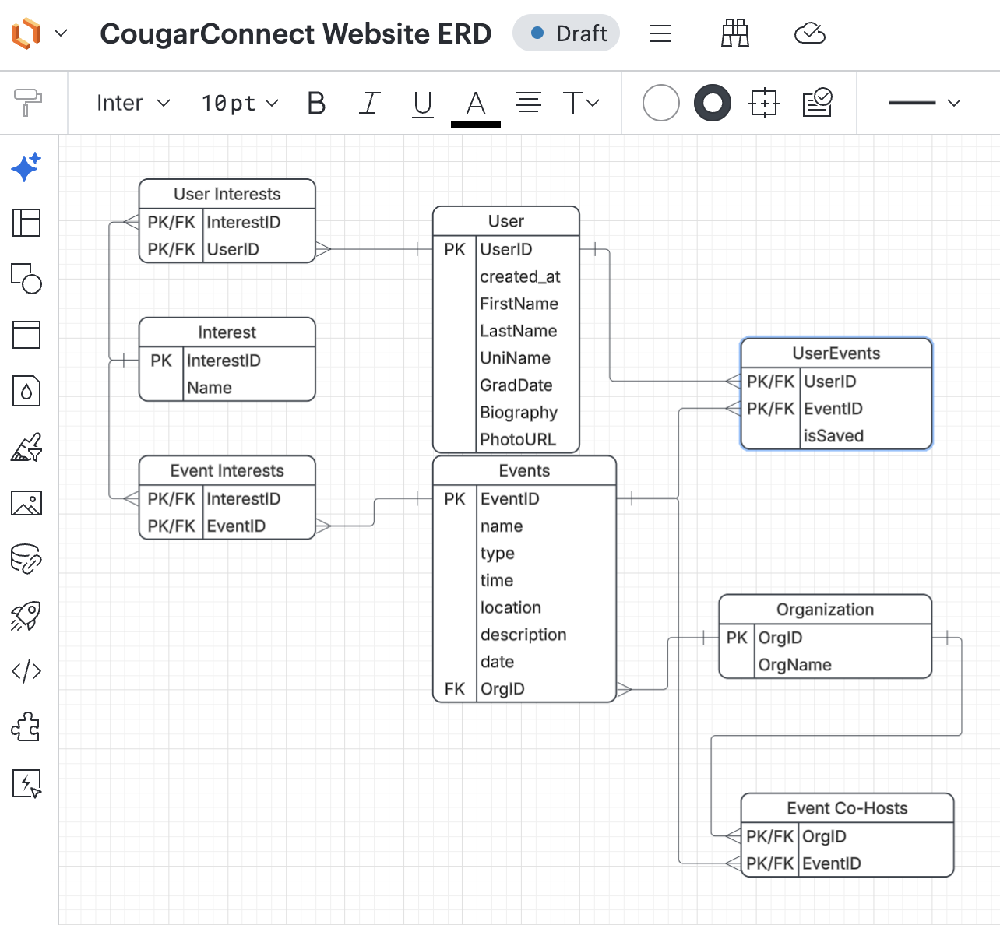

# Cougar Connect

## App Summary

BYU events are scattered across campus organizations, locations, and communication channels. Students can struggle to know where to look or which opportunities are relevant to them. Cougar Connect focuses first on an upperclassman who wants to build their résumé and get involved on campus. The app brings sample events into one place, with a searchable calendar and filters for interests, event type, time, location, and hosting organization. Students create a profile and select interests to discover opportunities that fit their goals. They can save events, review event details, and export events to their calendars. The team is connecting this responsive coursework app to Supabase for profile storage and email verification, providing a starting point for maintenance and support for additional student personas.

## ERD



The Step 1 ERD models User, Interest, Events, and Organization, with join tables for user interests, event interests, saved user events, and event co-hosts.

The team is implementing a Supabase backend to persist all information entered on the Create Profile page: full name, university, study level, graduation month, primary interest, bio, and optional profile photo. Full name corresponds to FirstName and LastName; university, graduation month, bio, and photo correspond to UniName, GradDate, Biography, and PhotoURL. Study level and primary interest also need to be represented in the backend, even though they are not fields in the ERD's User table.

The code in this checkout currently stores the profile in localStorage, with one `name` value and a photo data URL. UserID, created_at, separate first/last names, and Supabase persistence are not yet implemented here.

## Tech Stack

| Layer | Technology | Why it fits our prototype |
| --- | --- | --- |
| Structure | HTML5 (`dist/index.html`) | Standard form controls and a simple entry point without a build process. |
| Presentation | CSS (`dist/styles.css`) | Responsive desktop and mobile layouts without a UI framework. |
| Interaction | Vanilla JavaScript (`dist/app.js`) | Profile creation, interests, calendar filtering, search, and saved events in a directly editable codebase. |
| Persistence | Browser localStorage, key `cougar-demo` | Demonstrates persistence across refreshes without server setup. |
| Backend (in progress) | Supabase | The team is implementing shared backend persistence for every input on the Create Profile page, aligned with the ERD. |
| Data | Fictional sample events and locally created events | Lets the team demonstrate discovery before connecting real event sources. |
| Local tooling | Homebrew, Node.js, and npm | Homebrew installs Node.js and npm on macOS; npm installs dependencies, builds the app, and starts the local server. |
| Runtime | Modern web browser and the npm-started local server | Gives teammates a consistent way to run the Supabase integration branch. |

The lightweight frontend keeps setup simple and lets the team focus on the profile and event-discovery experience while implementing the Supabase backend. The team’s `supabase-integration` branch uses the npm workflow below. Supabase will send a verification email during account registration; users must follow the link in that email to verify their email address. The static files in this checkout still represent the earlier localStorage prototype. The ERD describes the intended relational model; localStorage currently holds one JSON state object containing the profile, interests, saved event IDs, preferences, and events.

## How to Get It Running

These instructions target the team's `supabase-integration` branch in [Cougar-Connect on GitHub](https://github.com/nickgcioffi/Cougar-Connect).

1. On macOS, install Homebrew using the instructions at [brew.sh](https://brew.sh), then install Node.js and npm:

   ```sh
   brew install node
   node --version
   npm --version
   ```

2. Clone the repository and switch to the integration branch:

   ```sh
   git clone https://github.com/nickgcioffi/Cougar-Connect.git
   cd Cougar-Connect
   git checkout supabase-integration
   ```

3. Install dependencies, build the app, and start the local server:

   ```sh
   npm install
   npm run build
   npm start
   ```

4. Open the local app URL printed in the terminal. Keep the server running while using the app; press `Ctrl+C` to stop it.
5. Register using an email address you can access. **Supabase will send a verification email.** Check your inbox and spam folder, open the email, and follow its verification link. Return to the app and sign in if prompted.
6. Complete the Create Profile form and continue through interest selection.

For an existing copy of the team repository, start with `git checkout supabase-integration`, then run `npm install`, `npm run build`, and `npm start`.

If the integration branch requires Supabase configuration, use its environment-variable instructions or obtain the required configuration from the team. This static checkout contains no package manifest or Supabase configuration, so run the npm commands in the cloned team repository.

## Verifying the Vertical Slice

The target working button is **Create profile →**: it should store all information entered on the Create Profile page in Supabase and allow the app to retrieve it after a refresh.

1. Start the integration branch using the instructions above, register, and verify your email through the link Supabase sends.
2. Enter a recognizable full name such as `Jordan Miller`, select a university and study level, and enter a graduation month and primary interest. Add a distinctive bio such as `Looking for technology networking events` and an optional profile photo.
3. Click **Create profile →** and confirm that the app reports success or advances to the next onboarding step. Complete interest selection if prompted.
4. In the team's Supabase project, confirm that the saved profile contains every submitted field, including the photo reference if a photo was uploaded. Use the actual table and field names defined by the integration branch.
5. Refresh the app, then open the profile or **Settings → Edit profile**. Confirm that the name, university, study level, graduation month, primary interest, bio, and optional photo are restored from the backend.
6. Sign out and sign back in with the verified account, then confirm that the same profile is available. This checks that the saved information is associated with the correct account.

The earlier static prototype saves under the localStorage key `cougar-demo`. Persistence in that prototype alone does not verify the Supabase vertical slice. The integration workflow above reflects the team's supplied setup; it has not been run against the remote branch from this checkout.
